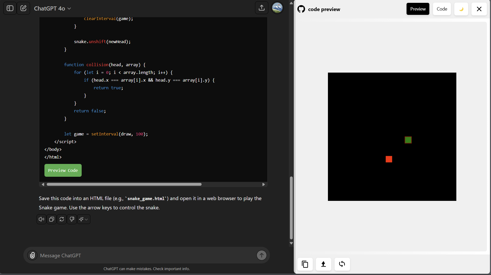

# ChatGPT Code Preview Extension

## Overview

The ChatGPT Code Preview Extension is a browser extension designed to enhance the coding experience on ChatGPT. It allows users to preview and interact with code snippets directly within the ChatGPT interface.

## Features

1. **Live Code Preview**: Instantly see the output of HTML, CSS, and JavaScript code.
2. **Syntax Highlighting**: View code with proper syntax highlighting for better readability.
3. **Copy Code**: Easily copy the entire code snippet to your clipboard.
4. **Download Code**: Download the code snippet as a file with the appropriate extension.
5. **Resizable Preview**: Adjust the size of the preview panel to your liking.

## Installation

1. Download the extension files (manifest.json, content.js, and styles.css).
2. Open your Chrome browser and navigate to `chrome://extensions/`.
3. Enable "Developer mode" in the top right corner.
4. Click "Load unpacked" and select the folder containing the extension files.

## Usage

1. Visit ChatGPT (https://chat.openai.com/).
2. When you see a code snippet, a "Preview" button will appear next to it.
3. Click the "Preview" button to open the preview panel.
4. Use the "Preview" and "Code" tabs to switch between the output and the source code.
5. Use the "Copy Code" and "Download Code" buttons as needed.

## Using CSP Unblock Extension

To fully utilize the ChatGPT Code Preview Extension, you may need to use the CSP Unblock extension to bypass Content Security Policy restrictions. Here's how to set it up:

1. Install the CSP Unblock extension from the Chrome Web Store:
   [CSP Unblock](https://chromewebstore.google.com/detail/csp-unblock/lkbelpgpclajeekijigjffllhigbhobd)

2. Once installed, click on the extension icon in your browser toolbar to activate it for chat.openai.com.

3. The CSP Unblock extension will remove the following CSP-related response headers:
   - "content-security-policy"
   - "content-security-policy-report-only"
   - "x-webkit-csp"
   - "x-content-security-policy"

4. With CSP restrictions removed, the ChatGPT Code Preview Extension should now work without any limitations, allowing you to run scripts and load resources that would otherwise be blocked.

## Important Security Note

Remember to disable the CSP Unblock extension when you're not using ChatGPT or testing your extension. Removing CSP can significantly reduce a website's protection against certain types of attacks, so it should only be used when necessary and on trusted sites.

## Contribution

Feel free to contribute to this project by submitting pull requests or reporting issues on the project's GitHub repository.

## License

This project is licensed under the MIT License.

